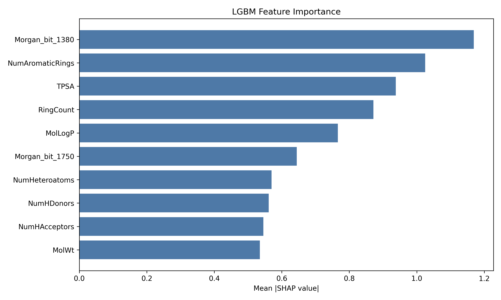
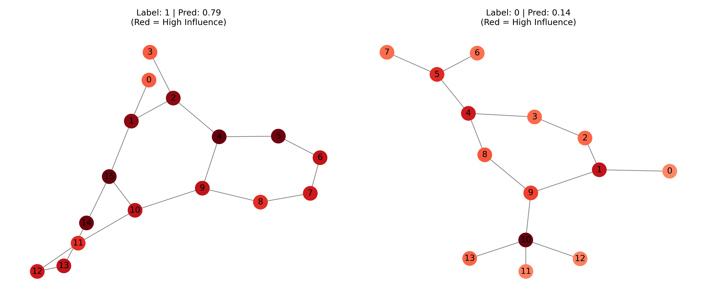
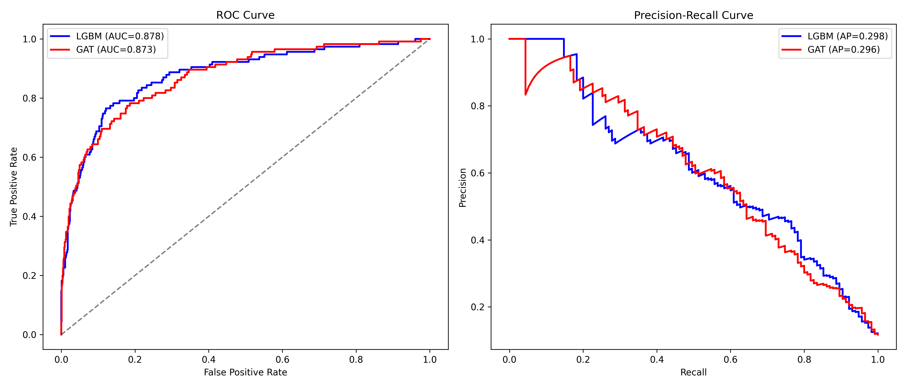

# 🧪 Liver Toxicity Prediction: From Troglitazone to Graph Neural Networks

## 📂 Project Structure

```text
liver_toxicity_project/
│
├── main.py                        # ORCHESTRATOR: Imports modules and runs the pipeline
├── requirements.txt               # List of dependencies (torch, rdkit, shap, lightgbm, etc.)
├── README.md                      # Project documentation
│
├── data/                          # Folder for raw data storage
│   └── (Tox21 data files will be downloaded here by MoleculeNet)
│
├── Figures/                       # Output folder for generated plots
│
└── src/                           # Source code package
    ├── __init__.py
    │
    ├── config.py                  # Contains the 'Config' class and global settings
    │
    ├── data/                      # Data loading and splitting logic
    │   ├── __init__.py
    │   ├── loader.py              # 'load_and_prepare_liver_data'
    │   └── splitting.py           # 'stratified_split_data' & 'simple_smote_alternative'
    │
    ├── features/                  # Feature engineering
    │   ├── __init__.py
    │   ├── descriptors.py         # 'extract_molecular_features' (For LGBM)
    │   └── graph.py               # 'prepare_gnn_data' & 'smiles_to_pyg_data_rdkit' (For GAT)
    │
    ├── models/                    # Model Architecture definitions
    │   ├── __init__.py
    │   └── gat_net.py             # 'HepatotoxicityGAT' class definition
    │
    ├── training/                  # Training loops and model-specific logic
    │   ├── __init__.py
    │   ├── lgbm_trainer.py        # 'train_lgbm_with_class_weights'
    │   └── gat_trainer.py         # 'train_gat_model', 'calculate_class_weights'
    │
    └── analysis/                  # Evaluation, Visualization, and Reporting
        ├── __init__.py
        ├── evaluation.py          # 'evaluate_on_test_set'
        ├── visualization.py       # 'analyze_lgbm_interpretability', 'visualize_attention_weights'
        └── reporting.py           # 'print_model_comparison'
```

---

## 📖 The Story: Why Computational Toxicology?

In 1997, the FDA approved **Troglitazone** (Rezulin), a breakthrough drug for diabetes. It had passed animal testing and clinical trials. Yet, within three years, it was withdrawn from the market after causing 63 deaths due to irreversible liver failure.

This tragedy highlighted a fundamental gap: biological complexity often eludes standard screening. This project aims to bridge that gap using **Computational Toxicology**. By leveraging the **Tox21 dataset**, we compare a classic machine learning approach (LightGBM) against a deep geometric deep learning model (Graph Attention Network) to predict liver toxicity (*NR-AhR* activation) directly from molecular structure.

### The Challenge
While the dataset contains over 7,000 molecules, it presents a **class imbalance of 7.5:1** (non-toxic vs. toxic). While this is a common issue in drug discovery, it requires careful handling—specifically weighted loss functions and stratified sampling—to prevent models from simply guessing "safe" for every drug.

---

## 🏗️ Methodology: A Hybrid Approach

We implemented two distinct modeling philosophies to solve this problem:

### 1. The Baseline: LightGBM
We extracted **Morgan Fingerprints (2048 bits)** and 10 physicochemical descriptors (e.g., MolWt, TPSA) to train a LightGBM classifier. We addressed imbalance using synthetic oversampling and `scale_pos_weight`.

### 2. The Innovation: Dual-Branch GAT
Our deep learning model, `HepatotoxicityGAT`, isn't just a graph network. It is a hybrid architecture that fuses two streams of information:
1.  **Graph Branch**: Learns topology and atomic interactions.
2.  **Fingerprint Branch**: Processes global molecular features via a dense encoder.

#### 🌟 Key Technical Highlight: The Virtual Node
Molecules often have long-range dependencies that standard GNNs struggle to capture (the "bottleneck" problem). To solve this, we inject a **Virtual Node**—a "super-atom" connected to every real atom in the molecule. This allows every atom to communicate with every other atom in just two hops.

```python
# snippet from src/data/datamodule.py
import torch_geometric.transforms as T

# The VirtualNode transform adds a "global scratchpad" node
virtual_node_transform = T.VirtualNode()

# BEFORE:
# x.shape -> [N_atoms, Features]
# edge_index -> [2, E_edges]

# AFTER:
data = virtual_node_transform(data)

# x.shape -> [N_atoms + 1, Features]  <-- Virtual node added at index N
# edge_index -> connects virtual node to all N atoms
```

---

## 🧠 Interpretability: Opening the Black Box

It is not enough to predict toxicity; we must know *why* a molecule is toxic.

### LightGBM: SHAP Analysis
Using SHAP (SHapley Additive exPlanations), we identified that specific structural patterns (Morgan bits) and the number of aromatic rings were the strongest predictors of toxicity.



### GAT: Attention Rollout
For the Graph model, we implemented a custom attention visualization. Standard attention only looks at the last layer. We perform **Attention Rollout** by accumulating the "outgoing influence" of every atom across **all layers** (not just the final one). This tells us which atoms consistently drove the decision-making process throughout the network's depth.

```python
# snippet from src/analysis/visualization.py

# Why sum over layers? 
# We want to know the "Total Historical Contribution" of an atom.
for edge_index_att, weights in att_list:
    src_nodes = edge_index_att[0] # The "Influencer"
    
    # We accumulate the attention weights onto the source node.
    # High accumulated weight = This atom "spoke" loudly to its neighbors.
    mask = (src_nodes != virtual_node_idx)
    valid_sources = src_nodes[mask]
    valid_weights = weights[mask]
    
    for idx, w in enumerate(valid_weights):
        source_atom = valid_sources[idx].item()
        node_influence[source_atom] += w.mean().item()
```


*Red nodes indicate atoms that the model paid the most attention to when classifying the molecule.*

---

## 📊 Results & Comparison

Both models performed comparably in terms of ranking ability (AUC ~0.87-0.88), though LightGBM maintained a slight edge in F1-score on this dataset size.

| METRIC | LGBM | GAT |
| :--- | :--- | :--- |
| **F1-Score** | **0.5738** | 0.5204 |
| **ROC-AUC** | **0.8782** | 0.8726 |
| **Precision** | **0.5574** | 0.4069 |
| **Recall** | 0.5913 | **0.7217** |



**Conclusion**: While LGBM is computationally cheaper and slightly more precise, the GAT model offers higher recall (catching more toxic drugs) and provides superior structural interpretability via attention maps, which is crucial for medicinal chemists.

---

## 🚀 Usage

1.  **Install Dependencies**
    ```bash
    pip install -r requirements.txt
    ```

2.  **Run the Pipeline**
    ```bash
    python main.py
    ```
    *This will automatically download the Tox21 data, train both models, and generate the figures in the `Figures/` directory.*